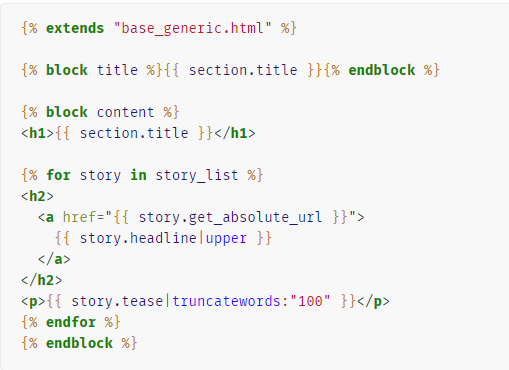
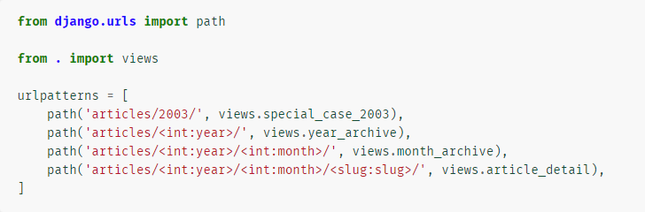
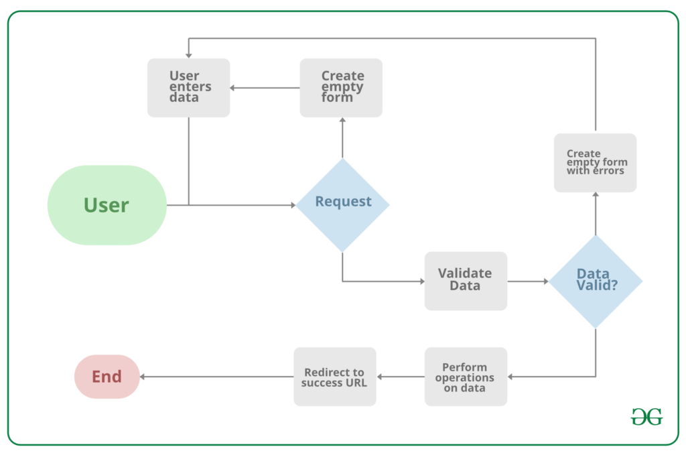

MVT (Model-View-Template) is a software design pattern for developing a web application.

**Model**: Model is the interface of data manipulation. It is responsible for maintaining data. It is the logical data structure behind the application and is represented by a database.

**View**: The view is the user interface, means what we see in our browser when browse a website. It is made by HTML/CSS/Javascript.

**Template:** Template is the structure or layout of user interface. 

# **Django Model:**

Django model is the built-in feature that Django uses to create tables, tables.field and constraints.
Django model is the SQL of database. 
We need to use django model to create new table in the database. In short if we want to create a new table we must create a new model.

The basics:

Each model is a Python class that subclasses django.db.models.Model.
Each attribute of the model represents a database field.
With all of this, Django gives you an automatically-generated database-access API;

Quick example

This example model defines a **Person**, which has a **first_name** and **last_name**:

**first_name** and **last_name** are fields of the model. Each field is specified as a class attribute, and each attribute maps to a database column.

The above **Person** model would create a database table like this:

**Some technical notes:**

The name of the table, myapp_person, is automatically derived from some model metadata but can be overridden. See Table names for more details.
An id field is added automatically, but this behavior can be overridden. See Automatic primary key fields.
The CREATE TABLE SQL in this example is formatted using PostgreSQL syntax, but it’s worth noting Django uses SQL tailored to the database backend specified in your settings file.

By using Django model we store data in the database conveniently. We can use admin panel of Django to create, update, delete or retrieve fields of a model and various similar operations.

Example of Django model and relationship with the table fields of the database.
 
# Example of model.

# **Django View:**

Django Views are Python function that takes web request (http requests) and returns a web response.
This response can be the HTML contents of a Web page, or a redirect, or a 404 error, or an XML document, or an image, anything that a web browser can display. 
Django views are part of the user interface — they usually render the HTML/CSS/Javascript in your Template files into what you see in your browser when you render a web page. 

# **Django Templates:**

Templates are the third and most important part of Django’s MVT Structure. A template in Django is basically written in HTML, CSS, and Javascript in a .html file.

A template is a text file. It can generate any text-based format (HTML, XML, CSV, etc.).
A template contains variables, which get replaced with values when the template is evaluated, and tags, which control the logic of the template.
Below is a minimal template that illustrates a few basics. 

# **Django URL patterns**

Views takes URL request as a parameter from users and return HTTP response. Each view needs to mapped to a corresponding URL pattern.  
To design URLs for an app we need to create a python module called URLconf. 
Here is a sample of URLconf.

Example requests:

A request to /articles/2005/03/ would match the third entry in the list. Django would call the function 
views.month_archive(request, year=2005, month=3).
/articles/2003/ would match the first pattern in the list, not the second one, because the patterns are tested in order, and the first one is the first test to pass.
Feel free to exploit the ordering to insert special cases like this. Here, Django would call the function 
views.special_case_2003(request)
/articles/2003 would not match any of these patterns, because each pattern requires that the URL end with a slash.
/articles/2003/03/building-a-django-site/ would match the final pattern. Django would call the function
views.article_detail(request, year=2003, month=3, slug="building-a-django-site").

# **Django Forms:**

If we make database-driven app, most of the cases we need to use forms that takes input from the users, and we use that information for logical operations in databases.
For example registering a user by taking username, password, email, names etc.
Django maps the fields defined on Django forms into HTML input fields.
Django handles three distinct parts of the work involved in forms:

-- preparing and restructuring data to make it ready for rendering
-- creating HTML forms for the data
-- receiving and processing submitted forms and data from the client

# **Form Validation:**

Data validation happens when we take data from the users, and forms should be able to validate data as per required. For example when user is asked to 
enter email form should be able to varify that entered input is an email address. For username and password may have condition too, for example if user is 
asked to put minimum length of them, then form should be able to varify that it fulfill those requirements.
