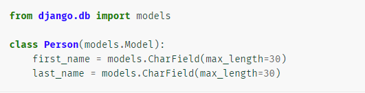
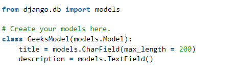

Django
Model:

Django model is the built-in feature that Django uses to create tables, tables.field and contraints.
Django model is the SQL of database. 
We need to use django model to create new table in the database. In short if we want to cteate a new table we must cteate a new model.

The basics:

Each model is a Python class that subclasses django.db.models.Model.
Each attribute of the model represents a database field.
With all of this, Django gives you an automatically-generated database-access API;

Quick example

This example model defines a **Person**, which has a **first_name** and **last_name**:

**first_name** and **last_name** are fields of the model. Each field is specified as a class attribute, and each attribute maps to a database column.

The above **Person** model would create a database table like this:

Some technical notes:

The name of the table, myapp_person, is automatically derived from some model metadata but can be overridden. See Table names for more details.
An id field is added automatically, but this behavior can be overridden. See Automatic primary key fields.
The CREATE TABLE SQL in this example is formatted using PostgreSQL syntax, but it’s worth noting Django uses SQL tailored to the database backend specified in your settings file.

By using Django model we store data in the database conveniently. We can use admin panel of Django to create, update, delete or retrieve fields of a model and various similar operations.

Example of Django model and relationship with the table fields of the database.
 
# Example of model.

